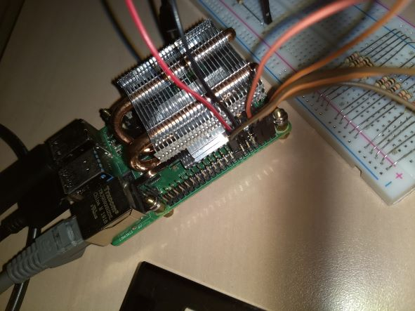
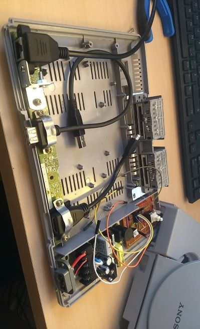

# psx_tiny13

Attiny13 code for management of the raspberry pi based PSX.
The tiny will deal with Power On/Off, reset, and Standby, it acts on the EN pin of the raspberry pi 4 if reset, and safe shutdown if Power button is pressed

Orange LED is Standby (was only green on original PSX)

Picture of system before installing the raspberry, the tiny is on top right, neqr the MaxWell 5V/5A power supply :

Power On :

.gif)

Boot :

Menu :

.gif)
